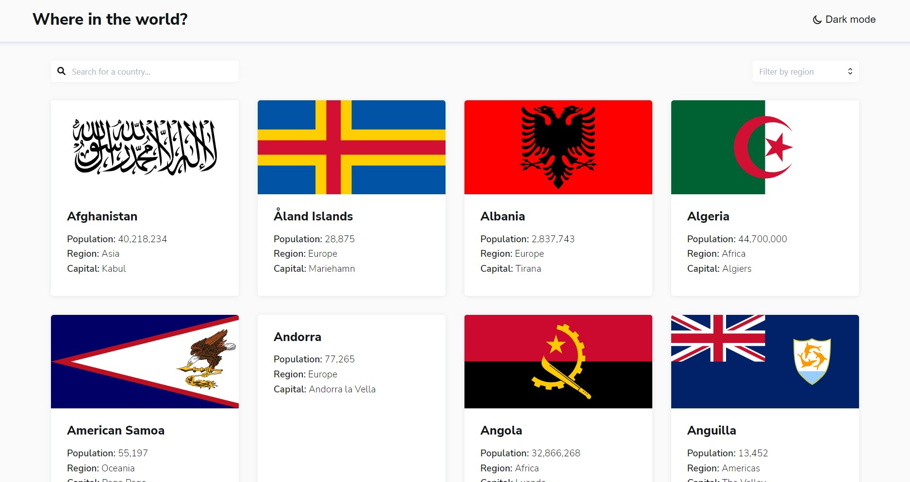
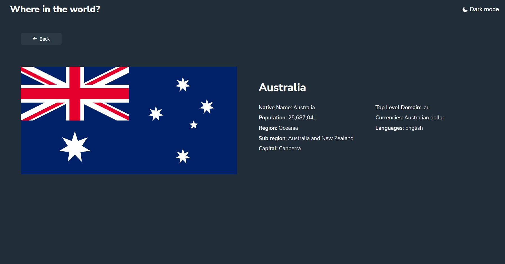

# Frontend Mentor - REST Countries API with color theme switcher solution

This is my solution to the [REST Countries API with color theme switcher challenge on Frontend Mentor](https://www.frontendmentor.io/challenges/rest-countries-api-with-color-theme-switcher-5cacc469fec04111f7b848ca).

## Table of contents

- [Overview](#overview)
  - [The challenge](#the-challenge)
  - [Screenshot](#screenshot)
  - [Links](#links)
- [My process](#my-process)
  - [Built with](#built-with)
  - [What I learned](#what-i-learned)
  - [Continued development](#continued-development)

## Overview

### The challenge

Users should be able to:

- See all countries from the API on the homepage
- Search for a country using an `input` field
- Filter countries by region
- Click on a country to see more detailed information on a separate page
- Click through to the border countries on the detail page
- Toggle the color scheme between light and dark mode _(optional)_

### Screenshot

### Links

- Solution URL: [https://github.com/andy-devs/rest-countries-api](https://github.com/andy-devs/rest-countries-api)
- Live Site URL: [https://rest-countries-api-sigma.vercel.app/countries](https://rest-countries-api-sigma.vercel.app/countries)

## My process

### Built with

- [React](https://reactjs.org/) - JS library
- [Countries API](https://restcountries.com/) - REST Countries API

### What I learned

I learned how to work better with React Router, multiple fetches from API and theme change. It was enjoyable experience!

### Continued development

I think I'm going to continue learning React and It's ecosystem and do more difficult projects with it.
